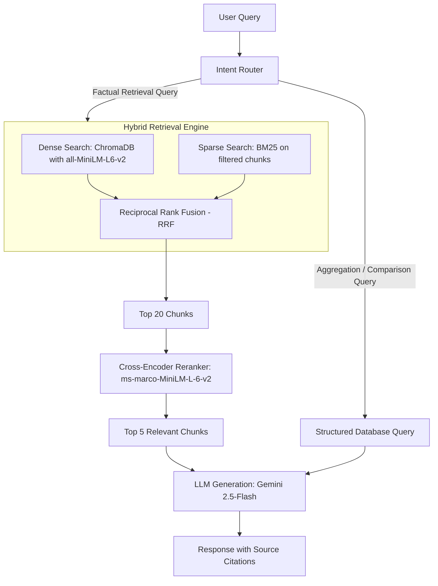

# 🐾 Placement Buddy Puddy (Puddy)

<p align="center">
  
</p>

<p align="center">
  <strong>An AI-powered placement preparation platform built on a production-grade multi-stage RAG pipeline.</strong>
</p>

<p align="center">
  
  
  
  
  
</p>

---

## 📖 Table of Contents
1. [Overview](#-overview)
2. [Application Tab Tour (For New Users)](#-application-tab-tour-for-new-users)
3. [Core Technical Architecture](#-core-technical-architecture)
4. [Tech Stack](#-tech-stack)
5. [Key Design Decisions](#-key-design-decisions)
6. [Quick Start & Setup](#-quick-start--setup)
7. [API Reference](#-api-reference)
8. [Project Structure](#-project-structure)

---

## 🔍 Overview

**Placement Buddy Puddy (Puddy)** is a sophisticated, data-driven placement intelligence platform. It ingests company interview experience articles and job descriptions (JDs), extracting structured Q&A pairs and metadata, and serves them to students via a high-performance **hybrid RAG retrieval pipeline** (BM25 + dense embedding similarity search) refined by **Cross-Encoder re-ranking**.

---

## 🗺️ Application Tab Tour (For New Users)

When you first open **Puddy**, you are greeted by an elegant, dark glassmorphic interface. Here is a walkthrough of each workspace tab:

### 1. 📊 Dashboard
* **What it is:** Your central command center.
* **What it shows:** High-level metrics including total indexed **Companies**, ingested **Document Chunks**, extracted **Interview Questions**, and processed **Ingested Files**. 
* **Key Features:** Provides a list of **Quick Queries** (one-click buttons for popular SQL/DSA company questions) and a list of recently ingested companies.

### 2. 💬 Ask Puddy
* **What it is:** The AI-powered conversational search assistant.
* **What it shows:** An interactive, responsive chat workspace.
* **Key Features:** Ask questions about specific companies, DSA topics, salary packages, or interview processes. Every answer is generated with **direct source citations** (linking back to the source PDF and page number) with anti-hallucination constraints.

### 3. 🏢 Companies
* **What it is:** The company database directory.
* **What it shows:** A grid of cards for each indexed company (e.g. Walmart, Amazon, ProcDNA).
* **Key Features:** Click any card to drill down into structured metadata (Salary CTC package, target role, eligibility criteria, required skills, and interview rounds) along with all historically extracted interview questions for that specific company.

### 4. 📄 Resume Analyzer
* **What it is:** A privacy-first skill gap assessment tool.
* **What it shows:** A secure file drop-zone where you upload your resume PDF and specify a target company.
* **Key Features:** The analyzer parses your resume, compares it against target company JDs, and outputs a **match score**, **matched skills**, **missing skills** (ranked by priority), and **personalized recommendations**. 
* *Security Guardrail:* Your resume text is processed strictly in-memory and is **never** saved to database or log stores.

### 5. 📈 Eval Dashboard
* **What it is:** A quantitative pipeline validator.
* **What it shows:** Baseline comparison metrics across different search algorithms.
* **Key Features:** Compares **Dense Vector Search** vs **Hybrid Search** vs **Hybrid + Re-ranked** across standard Information Retrieval metrics (**Precision@K, Recall@K, Mean Reciprocal Rank (MRR)**, and **LLM-as-judge Faithfulness**). Demonstrates proof of retrieval optimization.

### 6. ⚙️ Admin
* **What it is:** The ingestion data loader panel.
* **What it shows:** File upload zones and directory path ingestion utilities.
* **Key Features:** Upload company experience sheets and JDs. Initiates loading, doc-type segmentation, embedding calculations, and concurrent Pydantic-validated entity extraction.

---

## 🛠️ Core Technical Architecture

Puddy operates a multi-stage retrieval pipeline to maximize factual precision and context retrieval:



---

## 💻 Tech Stack

| Component | Technology | Description |
|-----------|-----------|-------------|
| **Frontend** | React 18, Vite, Vanilla CSS | Frost-glassmorphic UX with orbiting backlighting |
| **Backend** | FastAPI, Python 3.11 | Fast, type-safe async python API |
| **LLM** | Google Gemini (gemini-2.5-flash) | Generative responses + Pydantic structured output extraction |
| **Embeddings** | sentence-transformers/all-MiniLM-L6-v2 | 384-dimensional dense vectors for semantic parsing |
| **Re-ranker** | cross-encoder/ms-marco-MiniLM-L-6-v2 | Cross-attention similarity scoring for retrieval refinement |
| **Vector DB** | ChromaDB | Local vector store with metadata filtering |
| **Structured Store** | MongoDB / JSON fallbacks | Storage for metadata extraction and interview questions |
| **Evaluations** | Custom Evaluation Harness | IR metrics calculation + Faithfulness LLM-as-judge scoring |

---

## ⚙️ Key Design Decisions

1. **Pydantic Structured Outputs:** Entity extraction is validated via Pydantic model schemas (`InterviewQuestionsList`, `CompanyMetadata`), utilizing Gemini's structured output API.
2. **Concurrent Ingestion Engine:** Structured extraction runs concurrently using `asyncio` throttled by `asyncio.Semaphore(5)` to maximize pipeline throughput.
3. **Metadata Pre-Filtering:** Queries are filtered by company tags *before* running vector search, ensuring semantic context stays bounded.
4. **Reciprocal Rank Fusion (RRF):** Fuses sparse BM25 scores (essential for matching exact terms like "SQL", "DFS") with dense semantic vector searches.
5. **Cross-Encoder Re-ranking:** Re-scores top-20 chunks using full cross-attention. Cuts down context tokens from 20 chunks to the top-5 highly relevant segments.
6. **Quantitative Evaluation:** Anchored on 30 labeled ground-truth Q&A pairs to mathematically prove pipeline updates.

---

## 🚀 Quick Start & Setup

### 1. Clone & Environment Configuration
```powershell
cd RAG_PROJECT

# Create environment configuration file
copy .env.example .env
```
Open `.env` and configure your API key:
```env
GOOGLE_API_KEY=your_gemini_api_key_here
```

### 2. Backend Installation & Setup
```powershell
# Install requirements
pip install -r backend/requirements.txt

# Populate sample company documents
python -m backend.scripts.create_sample_data

# Run Ingestion Pipeline (Skip extraction if API key isn't set)
python -m backend.ingestion.pipeline --data-dir ./data
```

### 3. Start Servers
**Start Backend Engine:**
```powershell
python -m backend.main
# Swagger Docs at: http://localhost:8000/docs
```

**Start Frontend UI:**
```powershell
cd frontend
npm install
npm run dev
# Dashboard at: http://localhost:5173
```

### 4. Running Pipeline Evaluation
```powershell
# Run baseline queries
python -m backend.eval.run_eval

# Run with LLM-as-judge Faithfulness scoring
python -m backend.eval.run_eval --faithfulness
```

---

## 🔌 API Reference

### Retrieval & Generation
* `POST /api/query`: Submits search query. Supports metadata filtering (e.g. `{ "query": "SQL questions", "company": "ProcDNA" }`).
* `POST /api/resume/analyze`: Uploads resume PDF bytes and target company name for gap assessment.

### Ingestion & Admin
* `POST /api/ingest`: Re-runs ingestion pipeline on the backend `./data` directory.
* `POST /api/ingest/upload`: Direct upload of files to target data index.
* `GET /api/companies`: Retrieves list of all indexed companies.
* `GET /api/companies/{name}`: Retrieves structured company details and questions list.

### Evaluation
* `POST /api/eval/run`: Runs evaluation benchmark.
* `GET /api/eval/results`: Retrieves historical benchmark files.

---

## 📂 Project Structure

```
RAG_PROJECT/
├── backend/
│   ├── main.py              # FastAPI entrypoint
│   ├── config.py            # App settings
│   ├── ingestion/           # Ingestion, PDF loading & Pydantic extraction
│   ├── rag/                 # Query routing, hybrid search, RRF & reranking
│   ├── eval/                # Evaluation suite & metrics calculation
│   ├── resume/              # Privacy-safe resume skill gap analyzer
│   ├── api/                 # Endpoint routers & schemas
│   ├── db/                  # Vector DB & structured DB connectors
│   └── scripts/             # Mock sample PDF generator
├── frontend/                # React Vite Dashboard
│   ├── src/
│   │   ├── components/      # Sidebar, SplashLoader
│   │   ├── pages/           # Dashboard, Chat, Companies, Resume, Eval, Admin
│   │   └── services/        # API client
│   └── public/              # Favicon assets
├── data/                    # PDF documents
└── README.md
```
